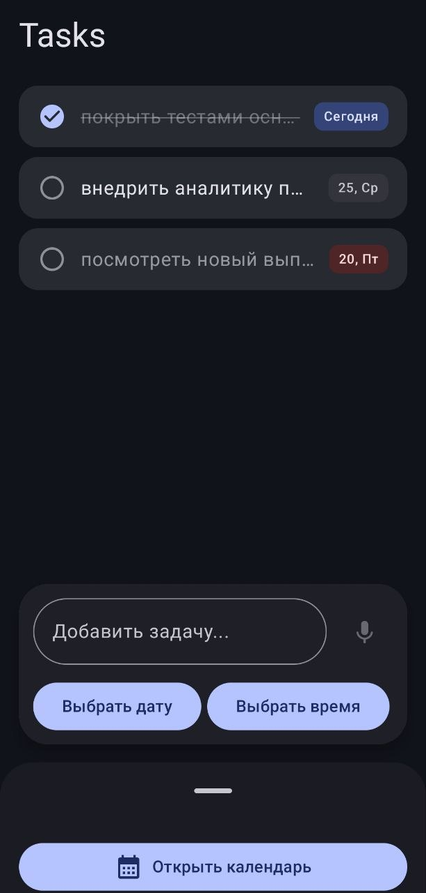
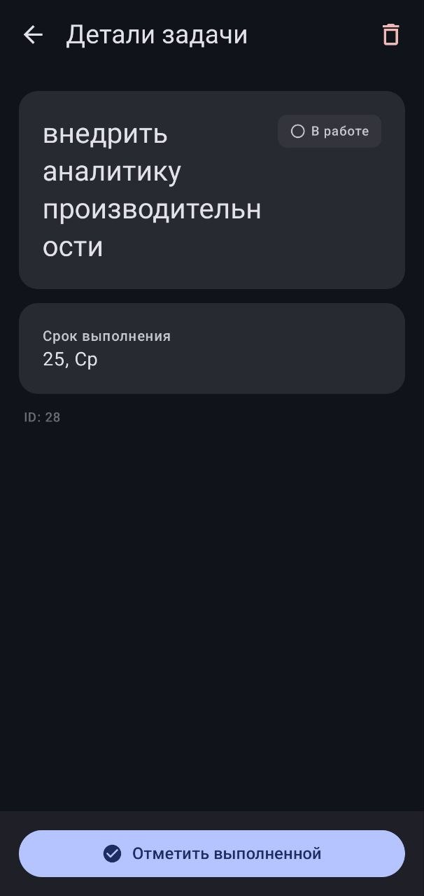
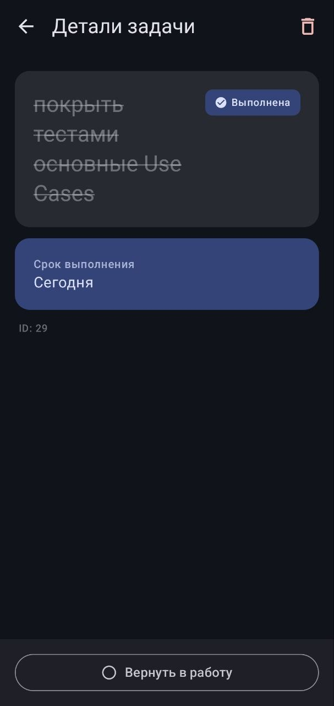
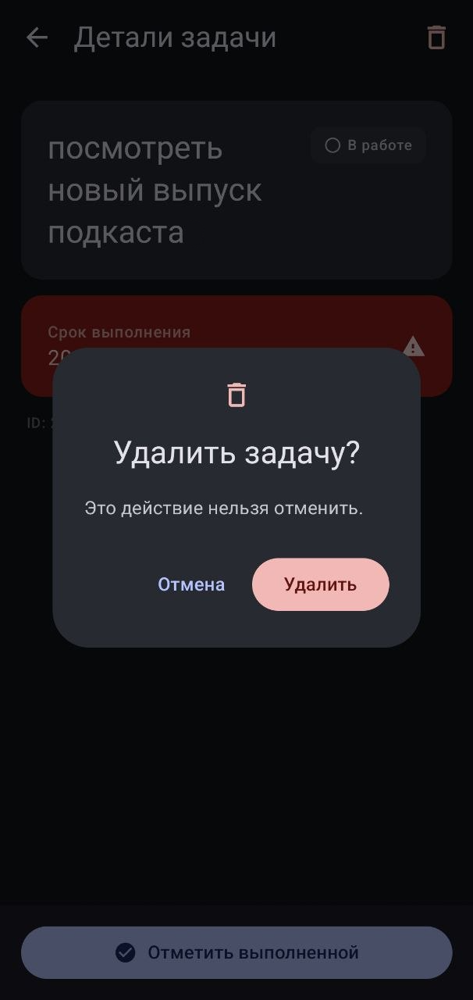
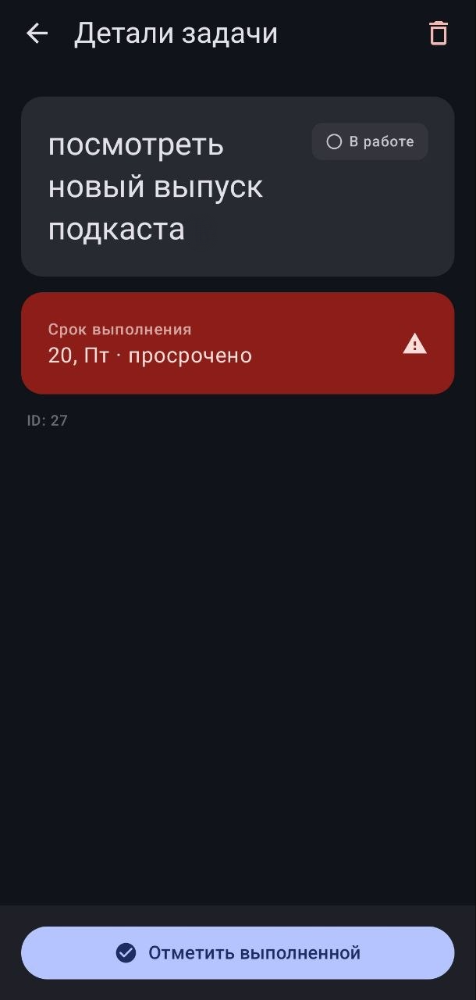

# Pet — Task Manager with AI Integration

Android-приложение для управления задачами с интеграцией Gemini AI и голосовым вводом.

## 🚀 Особенности

- **Голосовое создание задач** — распознавание речи через Vosk
- **AI-парсинг задач** — автоматическое извлечение структуры задачи из текста через Gemini 2.5 Flash
- **Offline-first архитектура** — работа без интернета с последующей синхронизацией
- **Надёжная фоновая синхронизация** — WorkManager гарантирует выполнение даже после перезагрузки
- **Современный UI** — Material Design 3, Jetpack Compose, адаптивные анимации

## 📱 Скриншоты

| Главный экран | Задача | Выполнена |                          Удаление                          | Просрочена |
|:-------------:|:------:|:---------:|:----------------------------------------------------------:|:----------:|
|  |  |  |  |  |

## 🛠 Технологический стек

### Архитектура
- **Clean Architecture** — разделение на domain/data/presentation слои
- **MVVM** — реактивный UI с StateFlow
- **Repository Pattern** — абстракция источников данных

### Основные технологии
- **Kotlin** — 100% код приложения
- **Jetpack Compose** — декларативный UI
- **Hilt** — dependency injection
- **Room** — локальная база данных
- **Retrofit + OkHttp** — сетевые запросы
- **Coroutines + Flow** — асинхронность
- **Navigation Compose** — навигация
- **WorkManager** — надёжная фоновая синхронизация с гарантией выполнения

### AI & Voice
- **Gemini API** — генеративная модель для парсинга задач
- **Vosk** — оффлайн-распознавание речи

### Тестирование
- **JUnit** — unit-тесты
- **MockK** — мокирование зависимостей
- **Turbine** — тестирование Flow
- **Compose UI Tests** — интеграционные тесты

## 🏗 Архитектурные решения

### Clean Architecture
Проект разделен на три слоя:

```
domain/          # Бизнес-логика (Pure Kotlin)
  ├── model/     # Domain-модели
  ├── repository # Интерфейсы репозиториев
  └── usecase/   # Use Cases

data/            # Слой данных
  ├── local/     # Room Database, DAO
  ├── remote/    # Retrofit API, Gemini
  ├── mapper/    # DTO ↔ Domain маппинг
  └── repository # Implementation

presentation/    # UI слой
  ├── home/      # Главный экран
  ├── taskdetail # Детали задачи
  ├── calendar/  # Календарь
  └── ui/        # Переиспользуемые компоненты
```

### Ключевые паттерны
- **Single Source of Truth** — Room как основной источник данных
- **Unidirectional Data Flow** — поток данных от ViewModel к UI
- **Event-driven архитектура** — sealed classes для UI событий

## 🔧 Сборка и запуск

### Требования
- Android Studio Hedgehog или новее
- JDK 11+
- Android SDK 24+

### Настройка

1. Клонируйте репозиторий:
```bash
git clone https://github.com/yourusername/Pet.git
```

2. Создайте файл `local.properties` в корне проекта:
```properties
GEMINI_API_KEY=your_api_key_here
```

3. Откройте проект в Android Studio и запустите сборку

## 📦 Структура проекта

```
app/
├── src/main/java/com/example/pet/
│   ├── data/
│   │   ├── local/       # Room: Database, DAO, Entities
│   │   ├── remote/      # Retrofit API, Gemini Parser
│   │   ├── mapper/      # Data трансформеры
│   │   ├── model/       # DTO
│   │   ├── audio/       # Speech-to-Text сервис
│   │   └── worker/      # Background sync
│   │
│   ├── domain/
│   │   ├── model/       # Business entities
│   │   ├── repository/  # Repository contracts
│   │   └── usecase/     # Business logic
│   │
│   ├── presentation/
│   │   ├── home/        # HomeScreen + ViewModel
│   │   ├── taskdetail/  # TaskDetail + ViewModel
│   │   ├── calendar/    # Calendar view
│   │   ├── navigation/  # NavGraph
│   │   └── ui/          # Shared components
│   │
│   ├── ui/theme/        # Material Theme
│   ├── PetApplication.kt # Hilt Application
│   └── MainActivity.kt
│
├── src/test/            # Unit тесты
└── src/androidTest/     # Instrumented тесты
```

## 🎯 Ключевые фичи

### AI-создание задач
Использую Gemini для парсинга естественного языка:
```kotlin
// Пример: "Завтра в 15:00 встреча с командой"
// → Task(title="Встреча с командой", day=2026-03-23, time=15:00)
```

### Голосовой ввод
Интеграция Vosk для оффлайн-распознавания:
- Загрузка модели в фоне
- Real-time транскрипция
- Обработка частичных результатов

### Оптимизация
- **ProGuard/R8** — минификация и обфускация
- **Build Variants** — debug/staging/release конфигурации
- **Network Security** — HTTPS-only, certificate pinning ready

## 🧪 Тестирование

Запуск тестов:
```bash
# Unit тесты
./gradlew testDebugUnitTest

# UI тесты
./gradlew connectedAndroidTest
```

Покрытие тестами:
- Use Cases — 100%
- ViewModel — ключевые сценарии
- Repository — интеграционные тесты

## 📈 Что я реализовал

- Полную Clean Architecture реализацию
- Интеграцию с Gemini API для AI-парсинга
- Оффлайн-распознавание речи через Vosk
- Room Database с миграциями
- WorkManager для фоновой синхронизации — с гарантией выполнения даже после перезагрузки устройства
- Material 3 дизайн с кастомной темой
- Unit и UI тесты
- Production-ready сборку с ProGuard

## 🔐 Безопасность

- API ключи через `local.properties` (не коммитятся)
- HTTPS-only для production
- ProGuard обфускация
- Логирование только в debug-режиме

## 📝 Лицензия

MIT License

## 📬 Контакты

- Email: l3row77@yandex.ru
- Telegram: @Overcommitmen
- GitHub: github.com/lerowcopy

---

> **Примечание**: Проект создан в образовательных целях и демонстрирует навыки Android-разработки.
